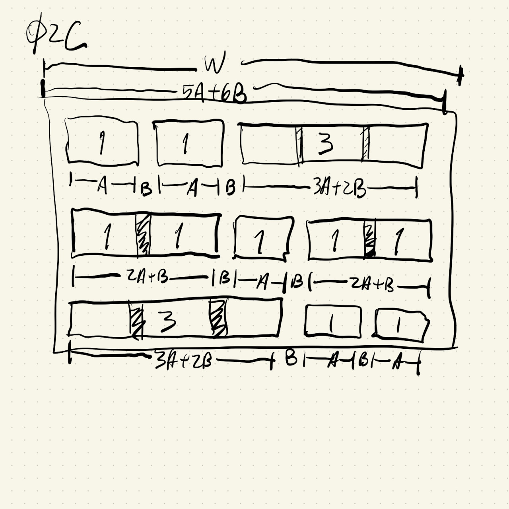
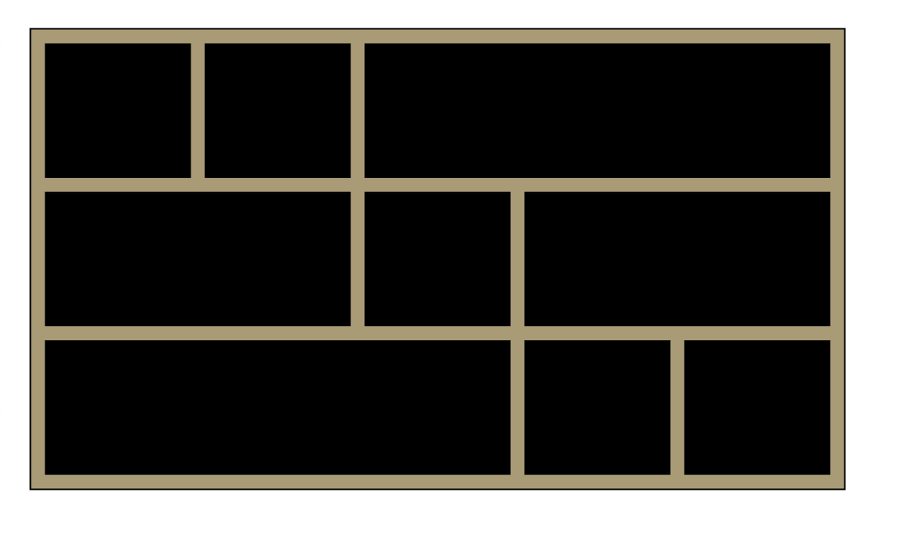
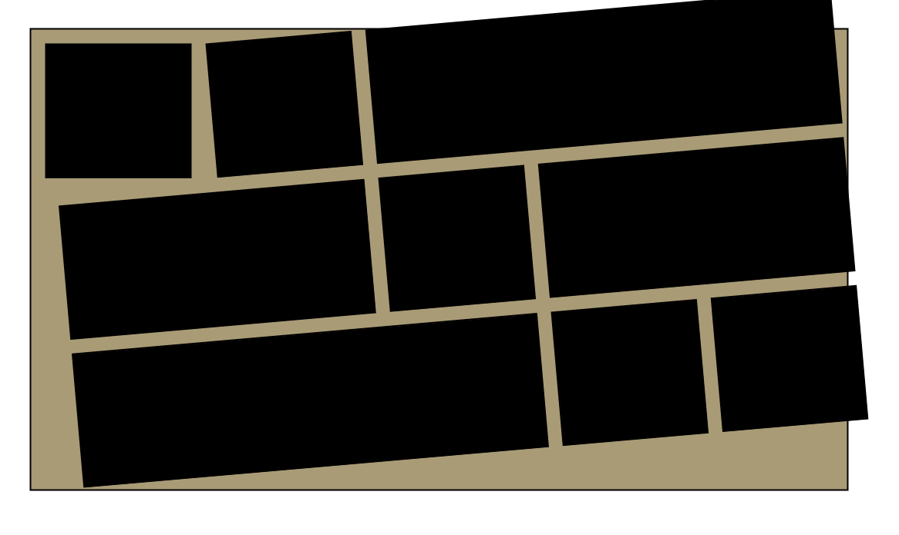
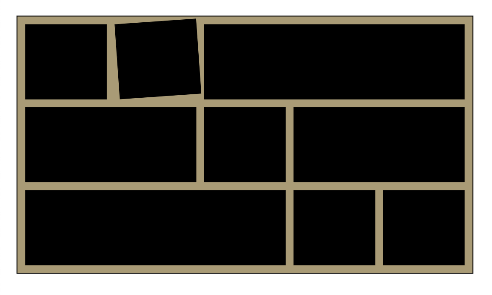
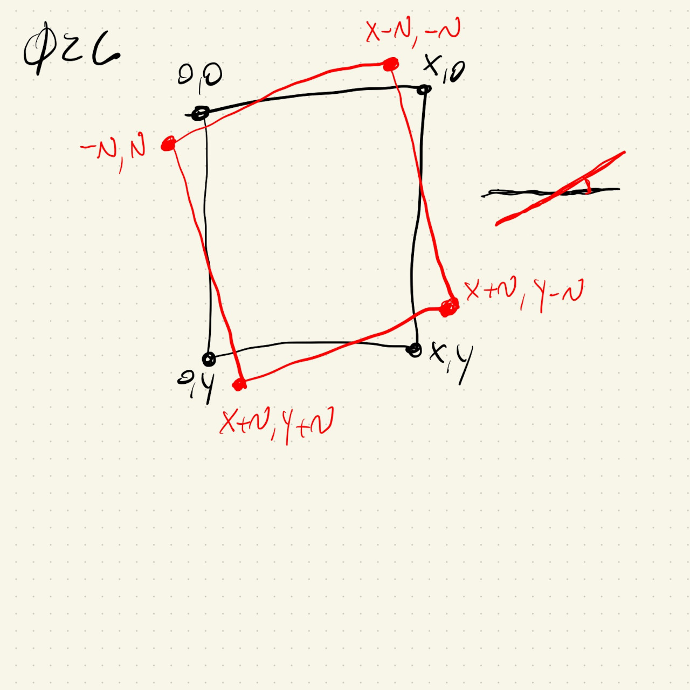
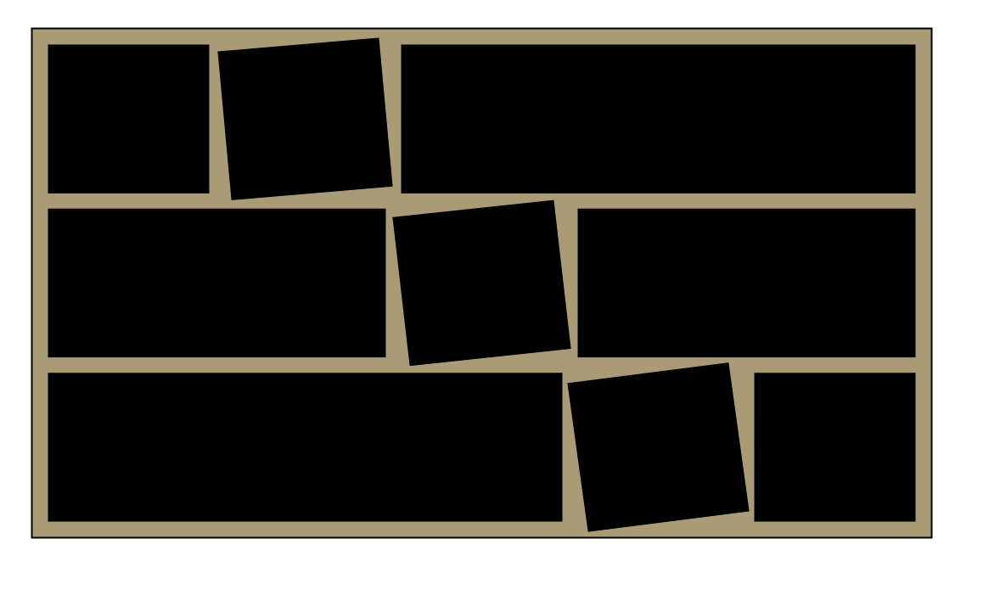

# HW02C

This was kind of fun once I drew the following grid:



The whole painting area is defined by a grid of three rows and five columns. The square that defines the grid elements has height and width of ```A```. There's also a margin between the grid elements, noted as ```B``` in the drawing. Once this was defined it was not so hard to define the painting area as a ```rect ``` of width ```5 * A + 6 * B``` and height ```3 * A + 4 * B``` . ```A``` and ```B``` are variables set to ```100``` and ```10```, respectivelly, but they can be changed to experiment with different sizes.

I also used translate to move along the x-axis as I drew the rectangles along each row. The only difficulty was keeping track of how much I had translated in order to reset back to the initial x value at the beginning of the second and third rows.

This strategy gives the following grid image:



I then experimented with the ```rotate()``` function. Since all rectangles are drawn after a translation, they all start at (0,0). I had problems getting this to work. At first I couldn't undo the rotations properly before drawing the next shapes:



And then, even after I sort of got it, it was hard to make the spacings look ok because the rotation is pivoting around the top left corner and it just didn't look good:



Back to the notebook, I drew what I thought would be a rough idea of a rotation around the center of the square:



As seen in the drawing, the four points of the square get shifted by ```+N``` or ```-N```, a value that could be adjusted in the code through a variable called ```nudge``` . After this I could easily define a ```quad()``` to draw the rotated squares:

```
quad(
  0 - nudge, 0 + nudge,
  A - nudge, 0 - nudge,
  A + nudge, A - nudge,
  0 + nudge, A + nudge
);
```

And, finally:


